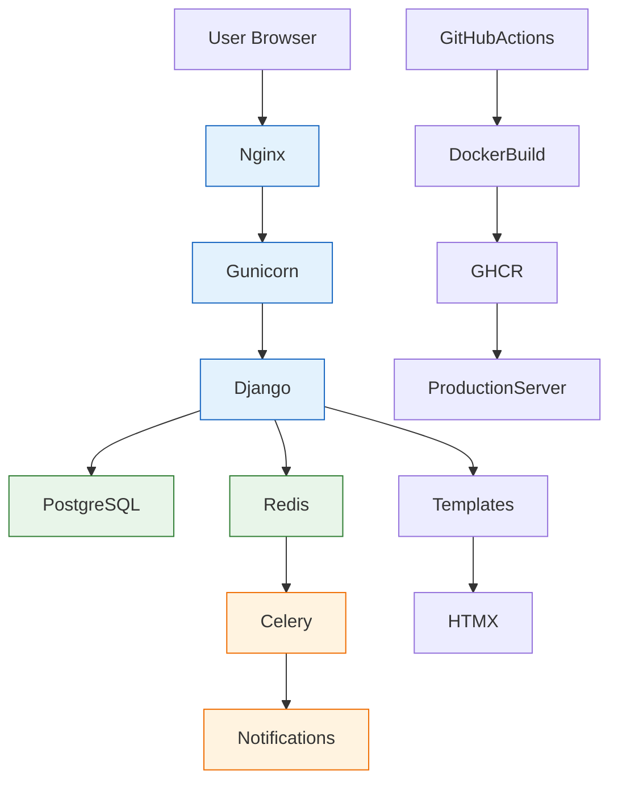

# MediscanClinic 

Django-проект сайта клиники диагностики и лабораторных исследований: каталог услуг, врачи, онлайн-запись, акции, обратная связь, личный кабинет пациента и выдача результатов анализов.  
[](https://github.com/AlexShcherb1173/MediscanClinic/actions/workflows/ci.yml)


---

## Содержание
- [О проекте](#о-проекте)
- [Ключевые возможности](#ключевые-возможности)
- [Что реализовано технически](#что-реализовано-технически)
- [Архитектура проекта](#архитектура-проекта)
- [Структура проекта](#структура-проекта)
- [Назначение модулей](#назначение-модулей)
- [Подготовка окружения](#подготовка-окружения)
- [Локальный запуск](#локальный-запуск)
- [Работа со статикой](#работа-со-статикой)
- [Заполнение демо-данными](#заполнение-демо-данными)
- [Тестирование](#тестирование)
- [Подготовка к деплою](#подготовка-к-деплою)
- [Деплой](#деплой)
- [Полезные management-команды](#полезные-management-команды)
- [Планы по развитию](#планы-по-развитию)
---
## О проекте
**MediscanClinic** — это полнофункциональное web-приложение 
клиники диагностики и лабораторных исследований на Django, 
ориентированное на пользовательский сценарий записи на приём 
и получения результатов исследований.
#### Система позволяет:
- просматривать услуги и врачей
- записываться на приём онлайн
- управлять расписанием и слотами
- получать результаты исследований
- получать уведомления
- работать с личным кабинетом пациента
#### Проект решает сразу несколько задач:
- показывает пациенту услуги и направления клиники;
- позволяет ознакомиться с врачами и их специализацией;
- даёт возможность оформить онлайн-запись;
- хранит записи и результаты в личном кабинете;
- поддерживает обратную связь и уведомления;
- может быть развёрнут локально и в production через Docker.
#### Проект демонстрирует практическую full-stack разработку на Django с использованием:
- асинхронных задач
- контейнеризации
- CI/CD
- production deployment
---
## Ключевые возможности
### Для пациента
- Каталог услуг
- категории услуг
- поиск
- фильтрация по цене
- сортировка
- пагинация
#### Врачи
- карточки врачей
- специализации
- стаж
- фотографии
- расписание
#### Онлайн запись
#### Пациент может:
- выбрать услугу
- выбрать дату
- выбрать доступный слот
- отправить заявку
#### Система:
- проверяет доступность
- создаёт запись
- отправляет уведомления
#### Личный кабинет пациента
#### В кабинете доступны:
- список записей
- история посещений
- результаты исследований
- профиль пациента
- Результаты исследований
#### Администратор может:
- загрузить результат
- прикрепить файл
#### Пациент:
- получает доступ к результатам
- может скачать PDF
#### Акции
- список акций
- детальная страница
- привязка услуг к акциям
#### Обратная связь
#### Формы:
- задать вопрос
- обратная связь
#### Сообщения отправляются:
- на email
- в Telegram
### Для клиники / администратора
- управление услугами, врачами, акциями и страницами;
- загрузка результатов исследований;
- управление расписанием и слотами записи;
- отправка уведомлений;
- работа с обращениями из форм сайта.
---
## Что реализовано технически
#### Проект демонстрирует следующие инженерные решения.
### Архитектура
- Django modular architecture
- разделение на приложения (apps)
- context processors
- reusable templates
- HTMX partial rendering
### Backend
- **Python**
- **Django**
- **Celery**
- **PostgreSQL**
- **Redis**
#### Асинхронные задачи
#### Используются Celery задачи для:
- уведомлений
- напоминаний
- отправки сообщений
#### Онлайн запись
#### Реализована система слотов:
- генерация временных интервалов
- проверка занятости
- выбор пользователем
#### Работа с файлами
- загрузка PDF результатов
- хранение в media
- доступ через кабинет
#### Формы
#### Используются:
- Django Forms
- HTMX формы
- серверная валидация
#### Контекстные процессоры
#### Используются для:
- данных пациента
- отображения кабинета
- общих данных сайта
### Frontend
- **Django Templates**
- **HTMX**
- **Tailwind CSS**
- **JavaScript**
### Infrastructure / DevOps
- **Docker**
- **Docker Compose**
- **Gunicorn**
- **Nginx**
- **GitHub Actions**
- **GHCR (GitHub Container Registry)**
---

## Архитектура проекта
Проект построен как Django-monolith с разделением на прикладные модули (`apps`), каждый из которых отвечает за отдельную предметную область.  
### Основные слои:
- **Presentation layer**
  - Django templates
  - HTMX partials
  - Tailwind CSS
- **Application layer**
  - Django views
  - forms
  - services / helpers / context processors
- **Domain/Data layer**
  - Django models
  - fixtures
  - PostgreSQL
- **Async/Notifications**
  - Celery worker
  - Celery beat
  - Redis
- **Deployment**
  - Docker / Compose
  - Nginx
  - GitHub Actions

---


## Структура проекта
```text
MediscanClinic/
├─ backend/
│  ├─ apps/
│  │  ├─ accounts/
│  │  ├─ appointments/
│  │  ├─ cabinet/
│  │  ├─ contacts/
│  │  ├─ notifications/
│  │  ├─ pages/
│  │  ├─ patients/
│  │  ├─ promos/
│  │  ├─ results/
│  │  ├─ services/
│  │  └─ staff/
│  ├─ config/
│  │  ├─ settings/
│  │  │  ├─ base.py
│  │  │  ├─ dev.py
│  │  │  └─ prod.py
│  │  ├─ urls.py
│  │  ├─ wsgi.py
│  │  └─ celery.py
│  ├─ templates/
│  ├─ static/
│  ├─ static_src/
│  └─ manage.py
├─ docker/
│  └─ nginx/
├─ tests/
├─ Dockerfile
├─ compose.yaml
├─ requirements.txt
├─ tailwind.config.js
├─ .env.example
└─ README.md
```

## Назначение модулей
### accounts
#### Модуль аутентификации и пользовательских данных.
##### Функциональность:  
- модель пользователя;
- логин / регистрация / авторизация;
- backend аутентификации;
- вспомогательные функции работы с контактными данными;
- context processors для личного кабинета.

### appointments
#### Ключевой модуль онлайн-записи.
##### Функциональность:
- форма записи;
- выбор услуги;
- выбор даты через календарь;
- выбор временного слота;
- создание записи;
- генерация слотов;
- напоминания и вспомогательная логика.

### cabinet
#### Личный кабинет пациента.
##### Функциональность:
- отображение записей;
- история посещений;
- отображение результатов исследований;
- данные пользователя в интерфейсе кабинета.

### contacts
#### Формы контактов и обратной связи.
##### Функциональность:
- задать вопрос;
- форма обратной связи;
- отправка администраторам;
- интеграция с email / Telegram.

### notifications
#### Инфраструктурный модуль уведомлений.
##### Функциональность:
- Celery-задачи;
- Telegram-уведомления;
- вспомогательная логика асинхронной отправки.

### pages
#### Статические и служебные страницы сайта.
##### Функциональность:
- главная страница;
- контентные страницы;
- management commands для начального наполнения;
- общие entry-point механизмы для демонстрационного контента.

### patients
#### Данные пациентов.
##### Функциональность:
- профиль пациента;
- связь пациента с пользователем;
- данные, связанные с результатами и записями.

### promos
#### Акции и специальные предложения.
##### Функциональность:
- список акций;
- детальная страница акции;
- привязка услуг к акции;
- отображение рекламных блоков на сайте.

### results
#### Результаты исследований.
##### Функциональность:
- хранение результатов;
- загрузка PDF/файлов;
- выдача результатов в личном кабинете;
- генерация демо-PDF;
- интеграция с уведомлениями.

### services
#### Каталог услуг.
##### Функциональность:
- категории услуг;
- карточки услуг;
- фильтры, сортировка, поиск;
- блоки популярных услуг;
- отображение цены и описания.

### staff
#### Врачи и персонал.
##### Функциональность:
- карточки врачей;
- специализации;
- фотографии;
- информация о стаже и расписании;
- данные для отображения в блоках сайта и записи.

## Подготовка окружения
### Клонирование репозитория
```
git clone https://github.com/AlexShcherb1173/MediscanClinic.git
cd MediscanClinic
```
### Создание виртуального окружения  
```
cd backend
python -m venv .venv
```
### Активация
#### Windows (PowerShell):
`````.venv\Scripts\Activate.ps1`````
#### Linux / macOS:
```source .venv/bin/activate```
### Установка зависимостей
```
pip install --upgrade pip
pip install -r requirements.txt
```
##### Если зависимости backend лежат в отдельных файлах, используй фактический файл зависимостей проекта.

### Создание .env
#### Скопируй шаблон:
```cp ../.env.example ../.env```   
#### Для Windows:   
```copy ..\.env.example ..\.env```   
#### Заполни необходимые переменные окружения:
- DJANGO_SECRET_KEY
- DJANGO_SETTINGS_MODULE
- DJANGO_ALLOWED_HOSTS
- DB_NAME, DB_USER, DB_PASSWORD, DB_HOST, DB_PORT
- CELERY_BROKER_URL
- CELERY_RESULT_BACKEND
- email / telegram / sms переменные при необходимости

### Локальный запуск
#### Вариант 1. Без Docker
#### Из директории backend/:
```
python manage.py migrate
python manage.py runserver
```
#### Приложение будет доступно по адресу:
http://127.0.0.1:8000/   
#### Вариант 2. Через Docker Compose
#### Из корня проекта:
```docker compose up --build```
##### Если используется production compose-файл, команда может отличаться.

### Работа со статикой
#### Если у тебя используется Tailwind через npm, установи зависимости в корне проекта:
```npm install```
##### Для сборки CSS:
```npm run build```
##### или, если в проекте настроены другие скрипты:
```npm run build:css```
##### Для режима слежения:
```npm run watch```
##### или:
```npm run watch:css```

### Заполнение демо-данными
#### После запуска контейнеров и миграций проект можно заполнить демонстрационными данными.

### Базовое наполнение + генерация слотов  
```docker exec -it mediscanclinic-web-1 python manage.py bootstrap_demo_content --with-slots --skip-slots-if-exist```  
#### Эта команда:
- загружает фикстуры с услугами;
- загружает врачей;
- загружает акции;
- при необходимости загружает дополнительные демо-данные;
- вызывает генерацию слотов;
- не делает повторную генерацию слотов, если они уже существуют.
### Если нужно загрузить фикстуры вручную
#### Примеры:  
```
docker exec -it mediscanclinic-web-1 python manage.py loaddata services_categories.json  
docker exec -it mediscanclinic-web-1 python manage.py loaddata services.json  
docker exec -it mediscanclinic-web-1 python manage.py loaddata staff_seed.json  
docker exec -it mediscanclinic-web-1 python manage.py loaddata promos.json  
```
#### Генерация слотов отдельно  
```docker exec -it mediscanclinic-web-1 python manage.py generate_slots``` 

## Тестирование
### Pytest
#### Из директории backend/:
```pytest -q``` 
## Code quality 
#### Используются инструменты:  
- black
- isort
- flake8
- mypy
- pytest
#### black  
```black apps config --check```  
#### isort  
```isort apps config --check-only``` 
#### flake8  
```flake8 apps config --config .flake8  ```
#### mypy  
```mypy apps config --config-file mypy.ini ```

#### Полный локальный цикл проверки  
```
black apps config  
isort apps config  
flake8 apps config --config .flake8  
mypy apps config --config-file mypy.ini  
pytest -q  
```

## Подготовка к деплою
### Перед деплоем желательно проверить:
- заполнен ли production .env;
- корректны ли DJANGO_ALLOWED_HOSTS;
- корректны ли DJANGO_CSRF_TRUSTED_ORIGINS;
- создан ли секретный ключ;
- настроены ли PostgreSQL и Redis;
- настроены ли GHCR secrets для CI/CD;
- присутствуют ли docker-compose.prod.yml и docker/nginx/nginx.conf на сервере.
### Рекомендуемые production-переменные
- DJANGO_SETTINGS_MODULE=config.settings.prod
- DEBUG=False
- DJANGO_ALLOWED_HOSTS=130.193.59.9,127.0.0.1,localhost
- DJANGO_CSRF_TRUSTED_ORIGINS=http://130.193.59.9:8081
- APP_PORT=8081

## Деплой
### В проекте настроен CI/CD через GitHub Actions.
#### Pipeline выполняет:
##### CI
- lint
- type checking
- тесты
##### Build
- сборка Docker image
- публикация в GHCR
##### CD
- подключение по SSH
- обновление контейнеров
- запуск docker compose
### Deployment
#### Production стек:
- Docker
- Nginx
- Gunicorn
- PostgreSQL
- Redis
- Celery
### Общий сценарий деплоя
1. Push в ветку develop
2. GitHub Actions собирает Docker image
3. Image отправляется в GHCR
4. На сервере выполняется deploy
5. Контейнеры перезапускаются
6. Проверяется состояние runtime-настроек Django
#### Ручная проверка на сервере
```
cd /opt/mediscanclinic
docker compose -f docker-compose.prod.yml ps
docker compose -f docker-compose.prod.yml logs web --tail 100
curl -I http://127.0.0.1:8081
```
#### Проверка настроек внутри контейнера
```docker exec -it mediscanclinic-web-1 python manage.py shell -c "from django.conf import settings; print('ALLOWED_HOSTS =', settings.ALLOWED_HOSTS); print('CSRF_TRUSTED_ORIGINS =', getattr(settings, 'CSRF_TRUSTED_ORIGINS', []))"```

### Полезные management-команды
#### Миграции
``` 
python manage.py makemigrations  
python manage.py migrate  
```
#### Создание суперпользователя  
```python manage.py createsuperuser```
#### Загрузка демо-данных  
```python manage.py bootstrap_demo_content --with-slots --skip-slots-if-exist```
#### Генерация слотов  
```python manage.py generate_slots```
#### Загрузка результатов  
```python manage.py loaddata research_results.json```
#### Загрузка записей  
```python manage.py loaddata appointments.json```

## Планы по развитию
- улучшение UX формы записи;
- развитие личного кабинета;
- интеграция полноценного SMS-провайдера;
- интеграция платежей
- REST API
- расширение логики расписаний и слотов;
- улучшение CI/CD и bootstrap-механизмов;
- покрытие проекта тестами и документацией;
- подключение HTTPS + production-домена.
### Автор
#### Alex Shcherbyna
##### Full-stack developer
##### GitHub  
https://github.com/AlexShcherb1173
https://github.com/ScherbAlex/
##### Проект разработан как учебно-практическая fullstack/Django-система для демонстрации навыков backend, frontend и deployment-пайплайна.
